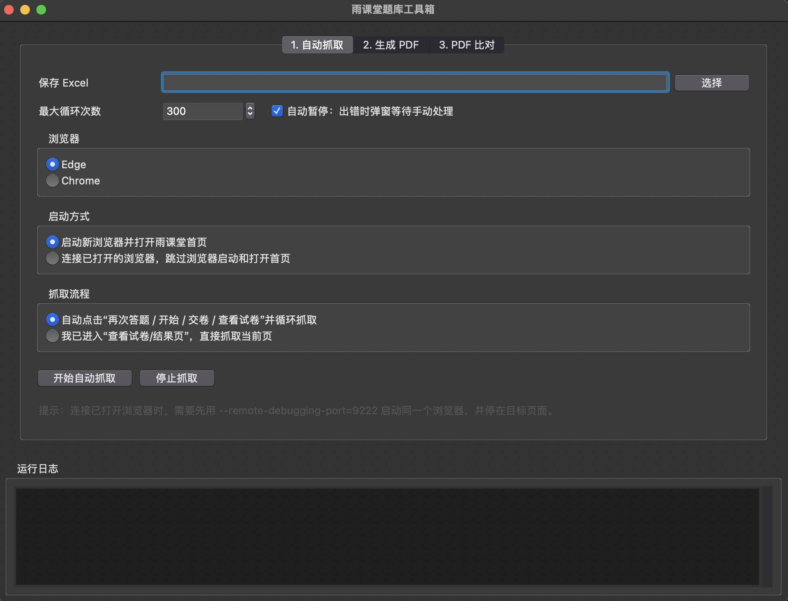
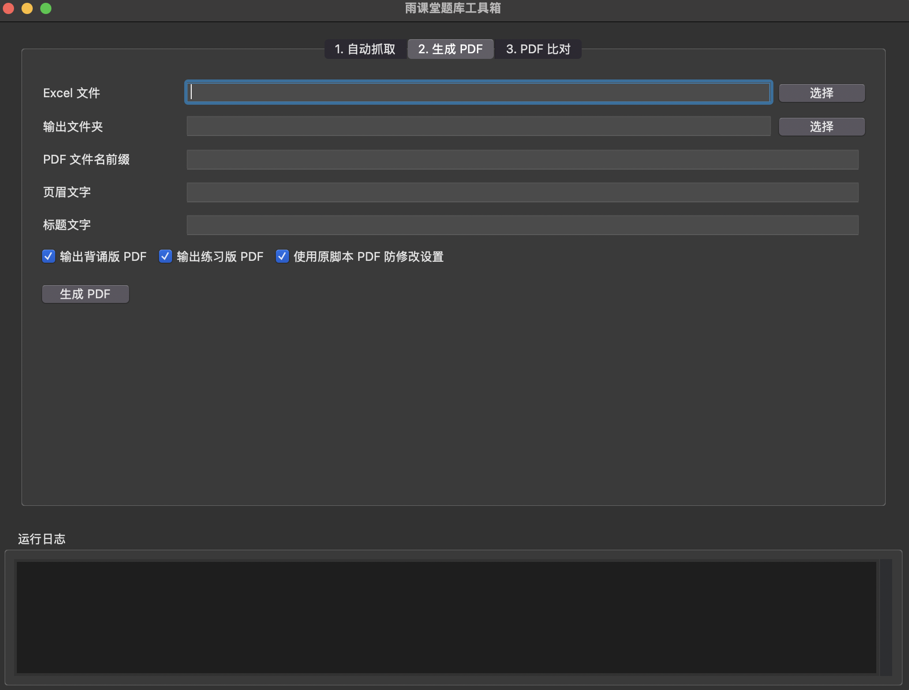
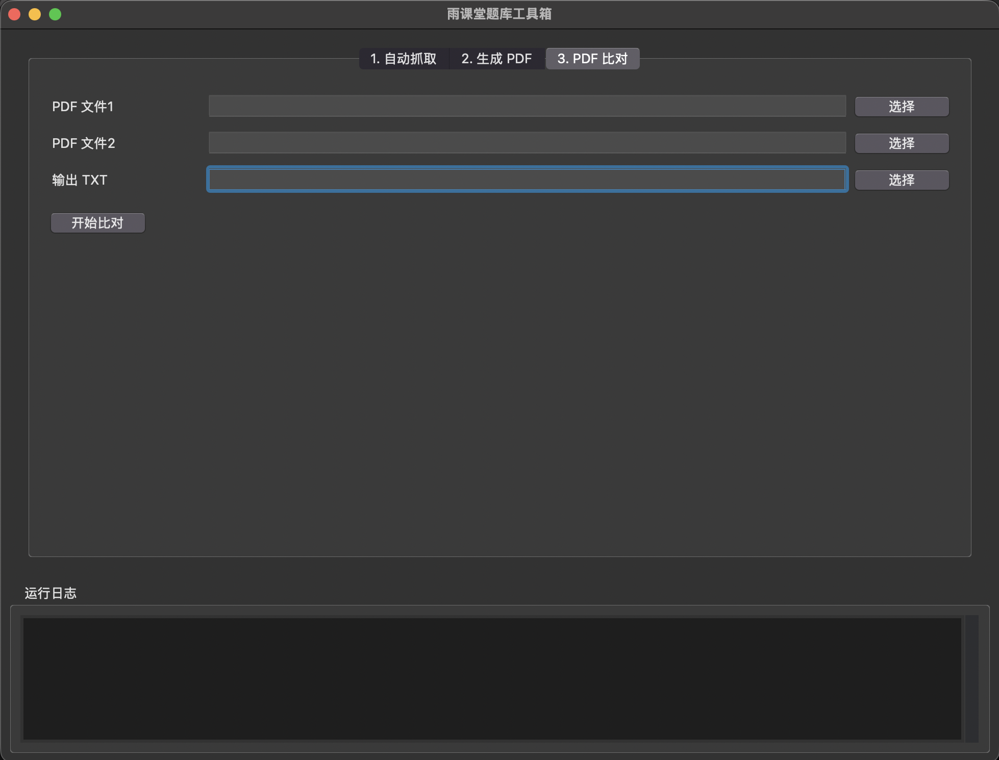

# 雨课堂题库工具箱 (Yuketang Toolkit)


> 本项目延续自原 **STORM_yuketang** 项目，在原有「题库抓取」「Excel 转 PDF」「PDF 题库差异比对」三部分功能基础上，整合为一个图形化工具箱。  
> 新版本保留原项目“半自动、可复习、可整理”的使用思路，并进一步加入浏览器连接、自动循环抓取、GUI 操作和跨平台适配。


## 更新说明 [2026.05]

本版本将原项目中的多个独立脚本整合为一个 GUI 程序：

- 原 `paquxin.py` 的雨课堂题目抓取功能，整合为 **自动抓取 / 当前页抓取** 模块。
- 原 `paiban.py` 的 Excel 题库转 PDF 功能，整合为 **生成背诵版 / 练习版 PDF** 模块。
- 原 `bidui.py` 的 PDF 差异比对功能，整合为 **PDF 比对并导出差异题目 TXT** 模块。
- 新增支持连接已经登录的 Edge / Chrome 浏览器，减少重复登录。
- 新增图形化界面，降低手动修改代码配置的门槛。
- 新增 Windows 11 与 macOS 的 WebDriver 查找和使用说明。

---

## 功能特点

### 1. 雨课堂题库抓取

<div align="center">
  
</div>

- **自动循环抓取**：可自动点击“再次答题 / 开始答题 / 交卷 / 查看试卷”，循环抓取题目。
- **当前页抓取**：如果你已经进入“查看试卷 / 结果页”，可以直接抓取当前页面内容。
- **支持已有题库续写**：程序会读取已有 Excel 题库，在原数据基础上继续追加。
- **自动去重**：以题目文本作为基础标识，避免重复写入相同题目。
- **支持 Edge / Chrome**：可启动新浏览器，也可连接已经打开并登录的浏览器。

### 2. Excel 题库生成 PDF

<div align="center">
  
</div>

- **背诵版 PDF**：每道题下方直接显示正确答案，适合集中复习。
- **练习版 PDF**：题目和答案分离，末尾附答案速查表，适合模拟自测。
- **中文字体适配**：自动尝试匹配 Windows / macOS 常见中文字体。
- **题目排版优化**：尽量避免题目和选项被拆分到不同页面，提升阅读体验。

### 3. PDF 题库差异比对

<div align="center">
  
</div>


- **双向比对**：找出仅在文件 1 中出现的题目，以及仅在文件 2 中出现的题目。
- **指纹比对**：忽略编号、空格、换行和部分标点差异，尽量聚焦题干本身。
- **结果导出**：自动生成 TXT 差异报告，方便后续整理。

---

## 环境要求

- Python 3.10 或更高版本，推荐 Python 3.12
- Microsoft Edge 或 Google Chrome
- Windows 11 / macOS

依赖库见 `requirements.txt`：

```text
pandas
openpyxl
selenium
webdriver-manager
reportlab
pdfplumber
```

---

## 项目结构

```text
yuketang-toolkit/
├── README.md
├── requirements.txt
└── yuketang_integrated_gui.py
```

> 发布或上传到 GitHub 时，一般不需要提交虚拟环境、浏览器 driver、生成的 Excel、PDF、TXT 结果文件。

---

## 安装依赖

### Windows 11

打开 PowerShell，进入项目目录：

```powershell
cd D:\path\to\yuketang-toolkit
py -m venv yuketang_env
.\yuketang_env\Scripts\Activate.ps1
python -m pip install --upgrade pip
python -m pip install -r requirements.txt
```

如果 PowerShell 提示无法加载 `Activate.ps1`，请先执行：

```powershell
Set-ExecutionPolicy -Scope CurrentUser RemoteSigned
```

然后重新激活虚拟环境：

```powershell
.\yuketang_env\Scripts\Activate.ps1
```

### macOS

打开 Terminal，进入项目目录：

```bash
cd /path/to/yuketang-toolkit
python3 -m venv yuketang_env
source yuketang_env/bin/activate
python -m pip install --upgrade pip
python -m pip install -r requirements.txt
```

---

## 启动程序

### Windows 11

```powershell
cd D:\path\to\yuketang-toolkit
.\yuketang_env\Scripts\Activate.ps1
python yuketang_integrated_gui.py
```

### macOS

```bash
cd /path/to/yuketang-toolkit
source yuketang_env/bin/activate
python yuketang_integrated_gui.py
```

启动后会打开图形化界面，主要包括三个功能页：

1. **自动抓取**
2. **生成 PDF**
3. **PDF 比对**

---

## 第一部分：雨课堂智能题库抓取工具

### 使用方式一：启动新浏览器

在程序的 **自动抓取** 页面中选择浏览器类型，例如 Edge 或 Chrome，然后点击启动。程序会打开雨课堂首页：

```text
https://www.yuketang.cn/v2/web/index
```

请在浏览器中登录雨课堂，并进入目标课程或目标练习页面。

### 使用方式二：连接已打开的浏览器

如果你已经登录雨课堂，可以先用远程调试模式打开浏览器，再让程序连接这个浏览器。这样可以减少反复登录的问题。

#### Windows 11 Edge

```powershell
Start-Process "msedge.exe" -ArgumentList "--remote-debugging-port=9222 --user-data-dir=$env:USERPROFILE\edge-selenium-profile"
```

#### Windows 11 Chrome

```powershell
Start-Process "chrome.exe" -ArgumentList "--remote-debugging-port=9222 --user-data-dir=$env:USERPROFILE\chrome-selenium-profile"
```

#### macOS Edge

```bash
open -na "Microsoft Edge" --args --remote-debugging-port=9222 --user-data-dir="$HOME/edge-selenium-profile"
```

### macOS Chrome

```bash
open -na "Google Chrome" --args --remote-debugging-port=9222 --user-data-dir="$HOME/chrome-selenium-profile"
```

启动后，可以打开下面地址检查调试端口是否可用：

```text
http://127.0.0.1:9222/json/version
```

如果能看到 JSON 内容，说明浏览器可以被程序连接。

### 抓取模式说明

#### 自动点击并循环抓取

适合当前页面有“再次答题”按钮的情况。程序会尝试自动完成以下流程：

1. 点击“再次答题”或“开始答题”。
2. 点击“交卷”。
3. 点击“确认交卷”。
4. 点击“查看试卷”。
5. 抓取当前页题目、选项和答案。
6. 保存到 Excel，并进入下一轮。

#### 直接抓取当前页

适合你已经手动进入“查看试卷 / 结果页”的情况。程序不会自动点击答题流程，只会抓取当前页面中已经显示出来的题目和答案。

### 输出 Excel 格式

程序生成的 Excel 题库一般包含以下列：

| 题目 | 答案 | A | B | C | D | ... |
| :--- | :--- | :--- | :--- | :--- | :--- | :--- |
| 下列关于 Python 的说法正确的是？ | ABC | 简单易学 | 开源免费 | 跨平台 | 只能在 Windows 运行 | ... |

---

## 第二部分：题库 Excel 转 PDF 生成器

进入程序中的 **生成 PDF** 页面，选择已经整理好的 Excel 题库文件。

常用配置包括：

- **Excel 文件**：抓取或整理后的题库文件。
- **输出文件夹**：PDF 保存位置。
- **PDF 文件名前缀**：用于生成输出文件名。
- **页眉文字**：显示在 PDF 页面顶部。
- **标题文字**：显示在 PDF 首页或文档标题区域。
- **输出背诵版 PDF**：题目下方显示答案。
- **输出练习版 PDF**：题目中隐藏答案，末尾附答案表。

设置完成后，点击 **生成 PDF**。

---

## 第三部分：PDF 题库差异比对工具

进入程序中的 **PDF 比对** 页面，选择两个 PDF 文件和输出 TXT 路径，然后点击 **开始比对**。

输出结果包括：

```text
=== 对比报告 ===
文件1: xxx.pdf
文件2: yyy.pdf

【仅在 文件1 中出现的题目】
...

【仅在 文件2 中出现的题目】
...
```

本工具适合用于比较两个版本题库之间的差异，例如旧版题库与新版题库、不同课程章节导出的题库等。

---

### WebDriver 说明

Selenium 控制浏览器时需要对应浏览器的 WebDriver：

- Edge 需要 `msedgedriver`
- Chrome 需要 `chromedriver`

程序会优先从以下位置查找 driver：

1. 虚拟环境目录
2. 用户下载目录
3. 系统 PATH
4. 通过 `webdriver-manager` 自动下载

如果自动下载失败，可以手动下载并放到推荐位置。

#### Windows 11 推荐位置

```text
yuketang_env\Scripts\msedgedriver.exe
yuketang_env\Scripts\chromedriver.exe
```

也可以通过环境变量指定：

```powershell
$env:MSEDGEDRIVER_PATH="C:\path\to\msedgedriver.exe"
$env:CHROMEDRIVER_PATH="C:\path\to\chromedriver.exe"
```

#### macOS 推荐位置

```text
yuketang_env/bin/msedgedriver
yuketang_env/bin/chromedriver
```

手动下载后可能需要添加执行权限：

```bash
chmod +x yuketang_env/bin/msedgedriver
chmod +x yuketang_env/bin/chromedriver
```

#### 下载地址

EdgeDriver：

```text
https://developer.microsoft.com/en-us/microsoft-edge/tools/webdriver
```

ChromeDriver：

```text
https://googlechromelabs.github.io/chrome-for-testing/
```

> 注意：driver 的主版本号需要和浏览器主版本号一致。例如 Edge 是 `147.x`，EdgeDriver 也应使用 `147.x`。

---

## 常见问题

### 1. Windows 找不到 Python

请确认安装 Python 时勾选了 `Add python.exe to PATH`。也可以在 PowerShell 中尝试：

```powershell
py --version
```

如果 `py` 可用，建议使用 `py -m venv yuketang_env` 创建虚拟环境。

### 2. WebDriver 下载失败

如果日志出现类似：

```text
Could not reach host
Failed to resolve
```

通常说明当前网络无法访问 WebDriver 下载源。请手动下载对应版本的 driver，并放入虚拟环境目录。

### 3. EdgeDriver / ChromeDriver 版本不匹配

请先查看浏览器版本。

Edge：

```text
edge://settings/help
```

Chrome：

```text
chrome://settings/help
```

然后下载相同主版本号的 driver。

### 4. 连接已打开浏览器失败

普通双击打开的浏览器不能直接被 Selenium 连接。必须使用 `--remote-debugging-port=9222` 命令启动浏览器。

如果仍然失败，请尝试：

- 确认旧浏览器进程已经完全退出。
- 换一个新的 `--user-data-dir` 目录。
- 打开 `http://127.0.0.1:9222/json/version` 检查端口是否正常。

### 5. macOS 提示 tkinter 缺失

macOS 如果运行时报 tkinter 相关错误，建议安装 python.org 官方 Python，或使用带 Tk 支持的 Homebrew Python。

---

## 免责声明 (Disclaimer)

1. **仅供学习交流**：本项目仅用于个人学习代码编写、自动化测试技术研究以及个人复习资料整理。
2. **请勿用于作弊**：严禁将本工具用于任何形式的考试作弊、违规刷题或商业用途。
3. **数据安全**：本工具运行在本地，不会主动上传用户账号、密码或题库文件，但请妥善保管生成的 Excel / PDF / TXT 文件。
4. **平台规则**：使用者应自行遵守雨课堂及所在学校、课程的相关规定。
5. **责任说明**：使用本工具所产生的任何后果由使用者自行承担。

---

## 写在最后

本项目延续原 STORM_yuketang 项目的思路：用尽可能直观、稳定的方式辅助整理个人复习资料。  
原项目已经完成了题目抓取、PDF 排版和题库比对的核心逻辑；本版本在此基础上进行了整合与界面化改造，希望能让更多 有类似需求的同学更容易使用和继续维护。

欢迎继续改进代码、补充适配规则、优化界面体验，也欢迎提交 Issue 或 Pull Request。

如果觉得好用，欢迎点个 Star ⭐️！

<a href="https://star-history.com/#AndyRong921/STORM_yuketang&Date">
  <picture>
    <source media="(prefers-color-scheme: dark)" srcset="https://api.star-history.com/svg?repos=AndyRong921/STORM_yuketang&type=Date&theme=dark" />
    <source media="(prefers-color-scheme: light)" srcset="https://api.star-history.com/svg?repos=AndyRong921/STORM_yuketang&type=Date" />
    
  </picture>
</a>

## License

MIT License

## Author

Original Author: [AndyRong921](https://github.com/AndyRong921)  
Maintainer / Toolkit Update: [HisimeeLos](https://github.com/HisimeeLos)
